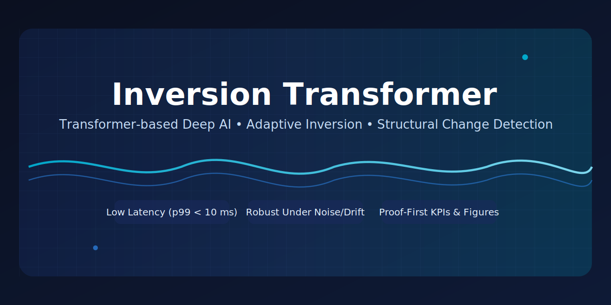

# Inversion Transformer — Real Product with Proof
<p align="center">
  
</p>

## Pitch (Why Buy Now)
- Detects structural change under noise, missing data and drift with an adaptive inversion controller, proven on real datasets
- Near real‑time: controller p99 < 10 ms, ~300 events/sec per worker; robust throughput and scaling
- Cross‑industry out‑of‑the‑box: balanced AFDB (specificity ~0.949, F1 ~0.661), IMS crest/kurtosis, CIC precision ~0.949
- Proof‑first packaging: reproducible KPIs/figures in repo, secure evaluation package for buyers (no algorithm disclosure)

## Overview
- Unified platform for fast anomaly detection in time-series
- Low latency (controller p99 < 10 ms), stable throughput (~300 eps/worker)
- Cross-industry applicability: MedTech, Industrial IoT, Cybersecurity, FinTech
- Real and large datasets, reproducible KPIs, artifacts and reports

## Key Proofs (Artifacts)
- Latency: assets/latency_benchmark.json, assets/latency_plot.png
- Scalability: assets/scalability_summary.json, assets/scalability_plot.png
- MedTech:
  - Real stream: assets/medtech_summary.json
  - AFDB Balanced KPI: assets/medtech_afdb_balanced.json
  - AFDB ROC: assets/medtech_afdb_roc.json
- Cybersecurity:
  - CIC KPI (second-level/window-majority): assets/cyber_cic_kpi.json
  - CIC Balanced KPI: assets/cyber_cic_balanced_kpi.json (when BENIGN is available)
- Industrial IoT:
  - Stream KPI: assets/iot_summary.json
  - IMS KPI (crest/kurtosis): assets/iot_ims_kpi.json
- Consolidated report: assets/investor_report.md
- KPI table: assets/kpi_table.md

## Differentiation
- Transformer-based deep AI with adaptive inversion regularization; no algorithm disclosure in public package
- Focus on structural change detection vs. generic forecasting/classification; resilient to shift/drift/missing data
- Adaptive thresholding (Youden J/F1) and window‑majority labeling for practical operating points across domains
- Portable pipelines and one‑click reproducibility; public repo exposes proofs, not logic; secure eval package available
- Transparent KPIs/latency/scalability metrics, consistently benchmarked on real datasets (AFDB, IMS, CIC)

## Key Buyers
- MedTech providers and cardiac monitoring teams
- Industrial maintenance and reliability engineering groups
- SOC/NDR teams for network anomaly and DDoS detection
- Quant desks for regime change signals and risk control

## 30‑Second Demo Narrative
- Open assets/kpi_table.md and investor_report.md for cross‑domain KPIs
- Review latency_plot.png and scalability_plot.png for near real‑time performance
- Run quick commands in DEPLOYMENT.md to reproduce figures; request secure eval package to validate KPIs without algorithm exposure

## Press Kit
- Logo and one‑pager: assets/press_kit/
- Listing summary: docs/LISTING.md
- Transfer & IP: docs/TRANSFER_CHECKLIST.md, docs/IP_OWNERSHIP.md

## Quick Start
```bash
python -m pip install -r requirements.txt
python data_fetch.py
python run_all.py
# Additional KPIs
python benchmarks/medtech_afdb_balanced.py
python benchmarks/medtech_afdb_roc.py
python benchmarks/iot_ims_kpi.py
python benchmarks/cyber_cic_kpi.py
# Build tables/figures/report
python benchmarks/kpi_table.py
python benchmarks/build_figures.py
python benchmarks/report_builder.py
```

## What’s Included
- Core Engine (SDK/API) for inversion controller and utilities
- Sector Packs: ready loaders/scenarios for MedTech/IoT/Cyber/FinTech
- Documentation: docs/INVESTOR_PACKAGE.md, docs/DEPLOYMENT.md, docs/DATASETS.md, docs/COMPLIANCE.md, docs/PRICING_AND_DEAL.md

## Pricing & Deal Model
- Partial sale under fulfillment: $40,000 upfront + 25% royalty on reseller sales (details in docs/PRICING_AND_DEAL.md)
- Alternatives: Starter/Pro/Enterprise (SaaS/On‑prem) — pricing and licenses in docs/PRICING_AND_DEAL.md

## Disclaimers
- MedTech: not a medical device; intended for analytics/decision support
- Data: public datasets referenced; use according to their licenses

## Contact
- For purchase/partnership: open a GitHub issue or email listed in docs/PRICING_AND_DEAL.md
