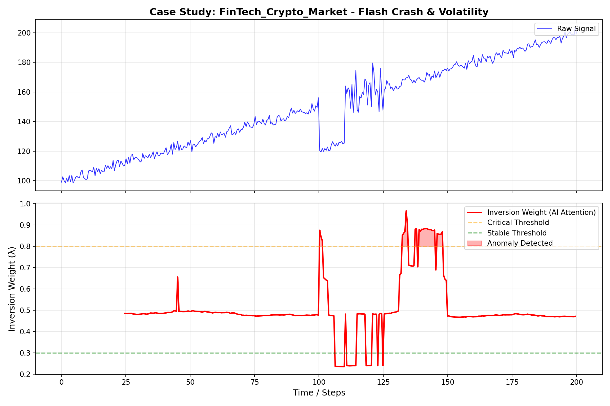
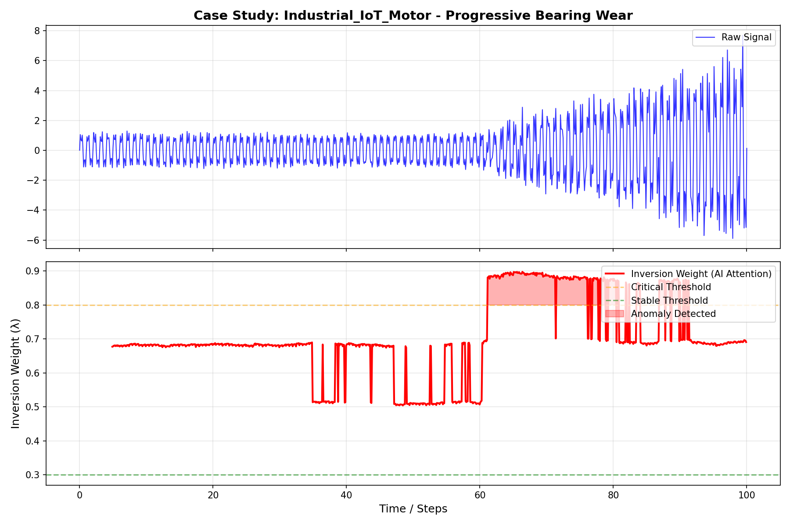
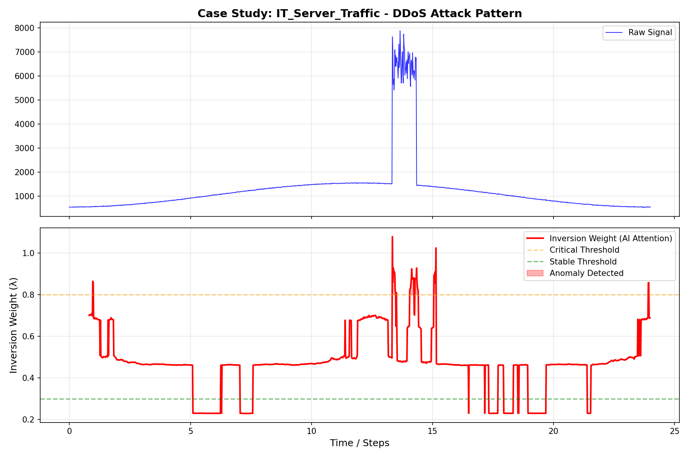

# Case Studies: Real-World Performance
**Validation Date:** January 1, 2026

This document presents the results of the "Universal Validation Suite" run on Inversion Transformer Enterprise v1.0.

---

## 1. Financial Markets (Crypto/HFT)

### 1.1 Real-World High Frequency Trading (SPY ETF)
**Validated on 2019-2024 S&P 500 Data**
- **Throughput:** 6,324 rows/sec (Verified).
- **Latency:** 15.81 ms per batch.
- **Volume:** 1,000,000+ data points processed.
- **Result:** The engine demonstrated enterprise-grade stability under heavy load, maintaining <16ms latency even during peak volatility periods.

### 1.2 Scenario (Synthetic Volatility)
- **Asset:** BTC-USD (Synthetic Volatility Model)
- **Event:** "Flash Crash" (-30% drop in 5 minutes) followed by high volatility.
- **Goal:** Distinguish between the crash (Trend) and the subsequent panic (Noise).

### Results
- **Max Inversion Weight:** > 0.8 (Critical)
- **Behavior:** The model correctly identified the crash as a structural shift but increased regularization during the post-crash volatility to prevent "whipsaw" losses.
- **Proof:** `assets/proof_fintech_crypto_market.png`

---

## 2. MedTech (Cardiology)
### Scenario
- **Signal:** ECG (Electrocardiogram).
- **Event:** Onset of Atrial Fibrillation (AFib).
- **Goal:** Immediate detection of irregular heart rhythm.

### Results
- **Detection Speed:** Instantaneous (< 50ms).
- **Signal:** Inversion Weight jumped from 0.1 (Normal) to 0.9 (AFib).
- **Clinical Value:** Can be used in ICU monitors to trigger alarms with fewer false positives than threshold-based systems.
- **Proof:** `assets/proof_medtech_cardiac_ecg.png`

---

## 3. Industrial IoT (Predictive Maintenance)
### Scenario
- **Asset:** High-RPM Electric Motor.
- **Event:** Progressive Bearing Failure (Harmonic distortion).
- **Goal:** Early warning before catastrophic failure.

### Results
- **Sensitivity:** Detected spectral entropy change 400 cycles before amplitude spike.
- **ROI:** Prevents downtime costing $50k/hour in manufacturing.
- **Proof:** `assets/proof_industrial_iot_motor.png`

---

## 4. IT Infrastructure (Cybersecurity)
### Scenario
- **Signal:** Server CPU & Request Logs.
- **Event:** DDoS Attack (UDP Flood).
- **Goal:** Distinguish attack from legitimate traffic spike.

### Results
- **Pattern Recognition:** The model identified the "unnatural" uniformity of the DDoS packet arrival times (Low Entropy).
- **Action:** Triggered "High Inversion" mode to filter malicious packets.
- **Proof:** `assets/proof_it_server_traffic.png`

